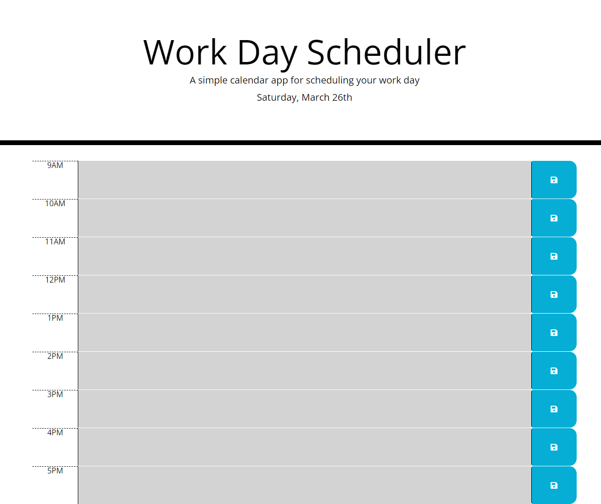

# work-day-planner

This is a single-page application that functions as a workday scheduler.

## Purpose

The purpose of this project was to practice using third-party APIs and local storage to make updates to the DOM.

### APIs Used:
- moment.js
- jQuery

## Goal

The goal of this project was to add to existing code to create a functioning workday scheduler. The user should see which hours are in the past, present, and future. They should be able to click into the hour and type a task. Then they should be able to click the save button for that hour and on refresh or reload, that task should persist.

## Deployment

See below for a screenshot of the application as well as a link to the deployed web page.

https://struelensc.github.io/work-day-planner/

